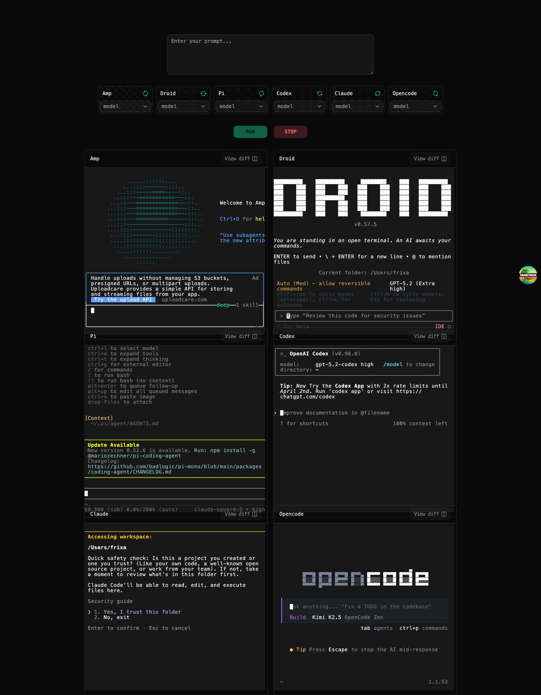

# Harness Bench

CLI agent benchmarker dashboard. Run multiple coding agents on the same task, watch their terminals live, and compare output side by side.



## Highlights

- Run `amp`, `opencode`, `claude`, `codex`, `pi`, `droid` in parallel
- WebSocket-driven PTY streaming for live terminal output
- Per-agent model selectors sourced from the model config
- Dark, monospace-first UI with `ghostty-web` terminals

## Quick Start

```bash
bun install
bun run dev
```

Open `http://localhost:3000`.

## Commands

```bash
bun run dev      # UI + PTY server
bun run ui       # UI only (Vite on :3000)
bun run pty      # PTY websocket server on :4000
bun run build    # production build
bun run test     # vitest
bun run check    # format + lint
```

## Requirements

- Bun
- Agent CLIs installed and available on `PATH`: `amp`, `droid`, `pi`, `codex`, `claude`, `opencode`

## Architecture

- Frontend: TanStack Start routes and root shell
- WebSocket client connects to `ws://localhost:4000/vt`
- Dashboard UI renders agent cards and live terminals
- Backend server spawns PTYs and streams base64 output
- Theme system controls dark/light styles and tokens

## Roadmap

- Graceful shutdown for PTYs on socket close
- Run-all and per-agent start/stop improvements
- Wire model selection into backend runs
