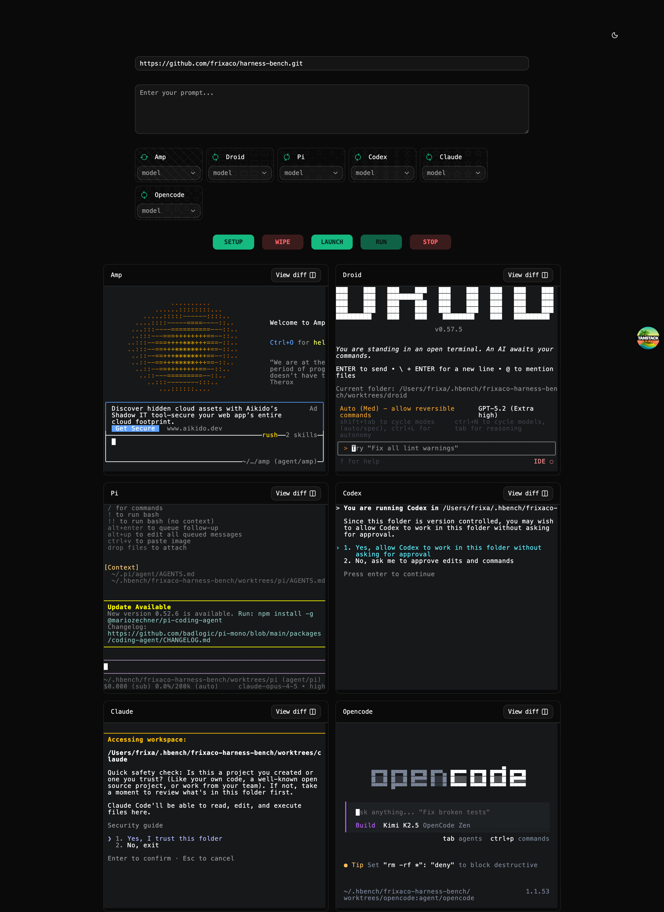

# Harness Bench

CLI agent benchmarker dashboard. Run multiple coding agents on the same task, watch their terminals live, and compare output side by side.



## Highlights

- Run `amp`, `opencode`, `claude`, `codex`, `pi`, `droid` in parallel
- WebSocket-driven PTY streaming for live terminal output
- Explicit global stop path via `POST /stop` with shutdown ladder (`Ctrl-C`, `Ctrl-C`, `SIGTERM`, `SIGKILL`)
- Per-agent model selectors sourced from the model config
- Dark, monospace-first UI with `ghostty-web` terminals

## Quick Start

- Amp: `curl -fsSL https://ampcode.com/install.sh | bash`
- Droid: `curl -fsSL https://app.factory.ai/cli | sh`
- OpenCode: `curl -fsSL https://opencode.ai/install | bash`
- Codex: `bun i -g @openai/codex`
- Pi: `bun i -g @mariozechner/pi-coding-agent`
- Claude Code: `curl -fsSL https://claude.ai/install.sh | bash`

```bash
bun install
bun run dev
```

Open `http://localhost:3000`.

## Commands

```bash
bun run dev      # UI + PTY server
bun run ui       # UI only (Vite on :3000)
bun run pty      # PTY websocket server on :4000
bun run build    # production build
bun run preview  # preview built app
bun run start    # start output server (.output/server/index.mjs)
bun run test     # vitest
bun run lint     # eslint
bun run format   # prettier
bun run check    # format + lint
```

## Requirements

- Bun
- Agent CLIs installed and available on `PATH`: `amp`, `droid`, `pi`, `codex`, `claude`, `opencode`
- Git

## Architecture

- Frontend: TanStack Start routes and root shell
- WebSocket client connects to `ws://localhost:4000/vt`
- Dashboard UI renders agent cards and live terminals
- Backend server spawns PTYs, streams base64 output, exposes `/diff` and `/stop`
- Theme system controls dark/light styles and tokens

## Roadmap

- Wire model selection into backend runs
- Add per-agent stop controls (not just global STOP)
- Persist run metrics/logs for comparison history
